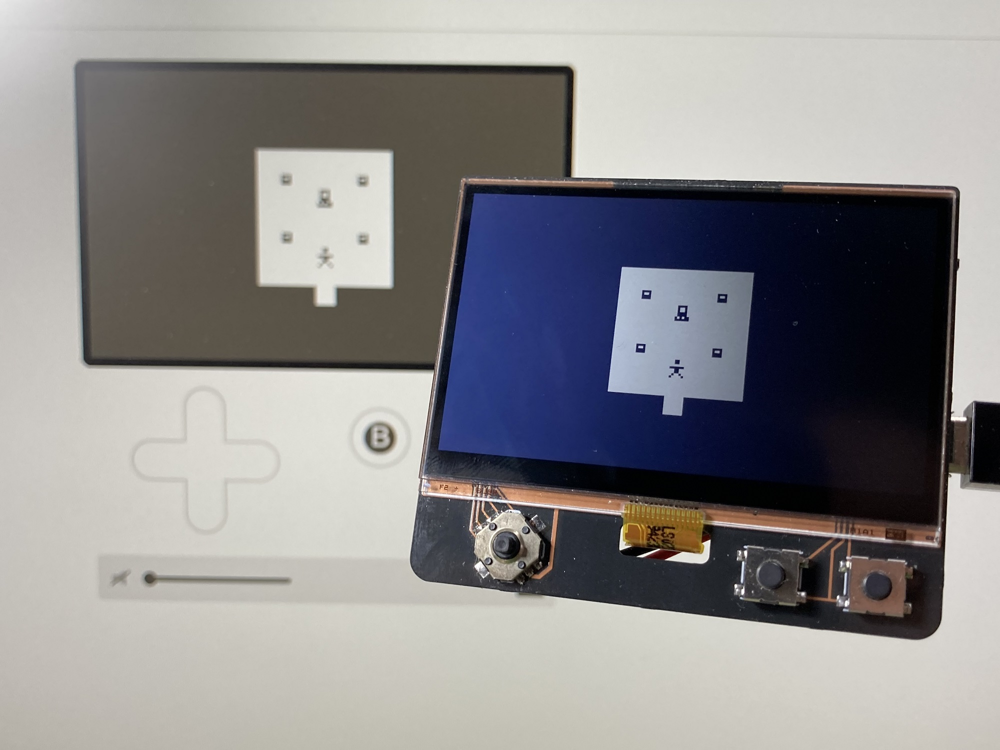

# uPulp

uPulp (micro-Pulp) is a little tool for displaying the Playdate Pulp Player on my ESP32-powered display board. 
This was botched together in an afternoon. Use at your own risk!

The code is a mix between these two projects: 
 - https://github.com/CoretechR/Keybon
 - https://github.com/CoretechR/ESP32-Handheld

